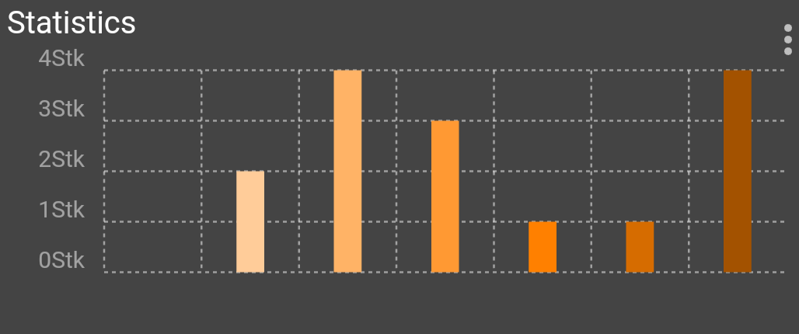

# Rander InfluxDB Data for MQTT Client

influx2mqtt graph designer is a small deamon written in Python
to prepare InfluxDB data for the MQTT mobile client [IoTMQTTPanel](https://play.google.com/store/apps/details?id=snr.lab.iotmqttpanel.prod)


# Requirements
* python3.8 or newer
* paho-mqtt ~= 1.6.1
* InfluxDB Client:
   * InfluxDB 1.X => influxdb ~= 5.3.1
   * InfluxDB 2.X => influxdb_client ~= 1.29.1

# Setup
* here we assume we install in ```/opt```

## Ubuntu 18.04
```
sudo apt-get install virtualenv python3-lxml
cd /opt
git clone https://github.com/Friedjof/influx2mqtt-graph-designer.git
cd influx2mqtt-graph-designer
virtualenv --system-site-packages -p python3 .venv
. .venv/bin/activate
pip3 install -r requirements.txt
```

## RHEL/CentOS 7 with EPEL
```
yum install git python36-virtualenv python36-lxml
cd /opt
git clone https://github.com/Friedjof/influx2mqtt-graph-designer.git
cd influx2mqtt-graph-designer
virtualenv-3 --system-site-packages .venv
. .venv/bin/activate
pip3 install -r requirements.txt
```

* modify your configuration and test it
```
chmod 755 ./influx2mqtt-graph-designer.py
./influx2mqtt-graph-designer.py
```

## Install as systemd service
Ubuntu
```
cp /opt/influx2mqtt-graph-designer/influx2mqtt-graph-designer.service /etc/systemd/system
```
RHEL/CentOS
```
sed -e 's/nogroup/nobody/g' /opt/influx2mqtt-graph-designer/influx2mqtt-graph-designer.service > /etc/systemd/system/influx2mqtt-graph-designer.service
```

```
systemctl daemon-reload
systemctl start influx2mqtt-graph-designer
systemctl enable influx2mqtt-graph-designer
```

## Run with Docker
```
git clone https://github.com/Friedjof/influx2mqtt-graph-designer.git
cd influx2mqtt-graph-designer
```

Copy the config from the [example](sql2mqtt-graph-designer.ini-sample) to ```influx2mqtt-graph-designer.ini``` and edit
the settings.

Now you should be able to build and run the image with following commands
```
docker build -t influx2mqtt-graph-designer .
docker run -d -v $PWD/influx2mqtt-graph-designer.ini:/app/influx2mqtt-graph-designer.ini --name influx2mqtt-graph-designer influx2mqtt-graph-designer
```

You can alternatively use the provided [docker-compose.yml](docker-compose.yml):
```
docker-compose up -d
```
If you're running the influxdb in a docker on the same host you need to add `--link` to the run command.

### Example:
* starting the influx container
```
docker run --name=influxdb -d -p 8086:8086 influxdb
```
* set influxdb host in `influx2mqtt-graph-designer.ini` to `influxdb`
* run docker container
```
docker run --link influxdb -d -v $PWD/influx2mqtt-graph-designer.ini:/app/influx2mqtt-graph-designer.ini --name influx2mqtt-graph-designer influx2mqtt-graph-designer
```

# Statistics

Mobile MQTT client [IoTMQTTPanel](https://play.google.com/store/apps/details?id=snr.lab.iotmqttpanel.prod)

# License
>You can check out the full license [here](LICENSE.txt)

This project is licensed under the terms of the **MIT** license.
